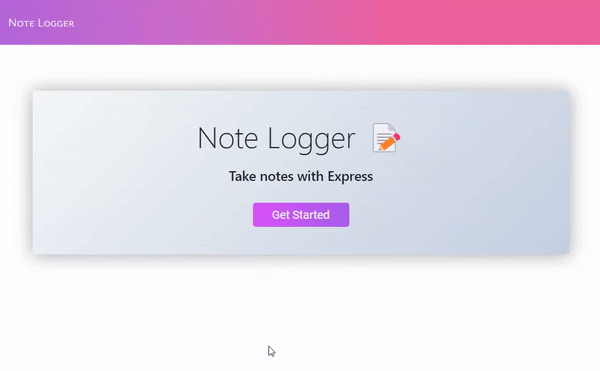
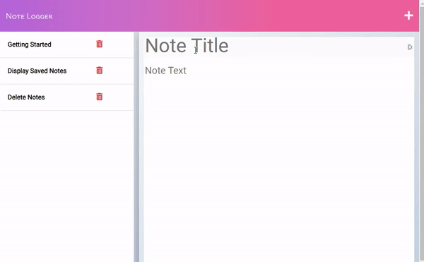
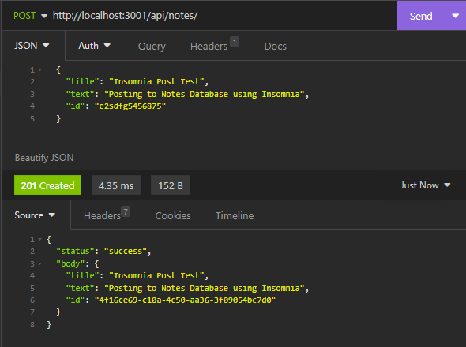

# Note Logger 

## Description
**Deployed Live URL for DEMO: [https://note-logger-03a612b15e73.herokuapp.com](https://note-logger-03a612b15e73.herokuapp.com)**

This note taking application was designed to allow the user to create and manage new notes.  
It is an **easy to use application** which makes it extremely convenient for writing notes.

>With Note Logger you can: 
- Create New Notes
- View Existing Notes
- Delete Existing Notes

Note: Saved data is not stored in local storage. Notes that are created and deleted are saved in the server's database using Express.js. Therefore, **Saving notes on Live URL for Demo is PUBLIC!** 

**About Development:**  
This note taking web application was created using Express.js and deployed using Heroku. Express is a framework for Node.js that is designed for building web applications and API's. Heroku is a cloud platform that lets developers deploy, manage, and scale modern apps.

## Application Preview
  

  

## Table of Contents

- [Installation](#installation)
- [Usage](#usage)
- [Contribution](#contribution)
- [Tests](#tests)
- [License](#license)
- [Questions](#Questions)

## Installation

To install this application on your local machine, you will need to:
1. Clone Note-Logger Repository.
2. Install Node.js
3. Install NPM

## Usage
**[Visit DEMO URL for Preview](https://note-logger-03a612b15e73.herokuapp.com//)**

**To run in your Local Machine:**
1. Open terminal under the server.js folder and type `npm install -y` to install dependencies.
2. Run `node server.js` in the terminal.
3. A link will display in the terminal with the port for the running server.
4. Open the web browser or Insomnia application and enter http://localhost:3001 
5. Now You are able to create, view, and delete notes. 

## Contributing

Created by: Chrsitian Palacios.  
To contribute to this repository you may contact me for further details. Contact details can be found below in the Questions Section.

## Tests

Tested API routes using Insomnia.  
Using Insomnia, I was able to check my GET, POST, and DELETE routes and ensure they were operational.  
To download insomnia visit: [https://insomnia.rest/](https://insomnia.rest/)

**POST Route Test Example:**  
  

## Credits

N/A

## License

  
 **The MIT License**  
 Please refer to the LICENSE in the repository.

## Questions

**If you have any questions you may reach me at my email: [cont_rune_encoder@outlook.com](mailto:cont_rune_encoder@outlook.com)**

**Here is a link to my Github Profile: [Profile Link: rune-encoder](https://github.com/rune-encoder)**

**If you would like to check out my other projects visit this link: [Projects Link: rune-encoder](https://github.com/rune-encoder?tab=repositories)**
